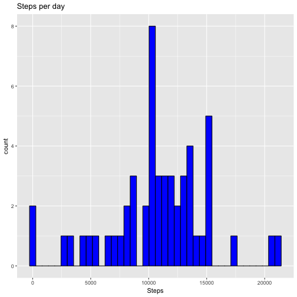
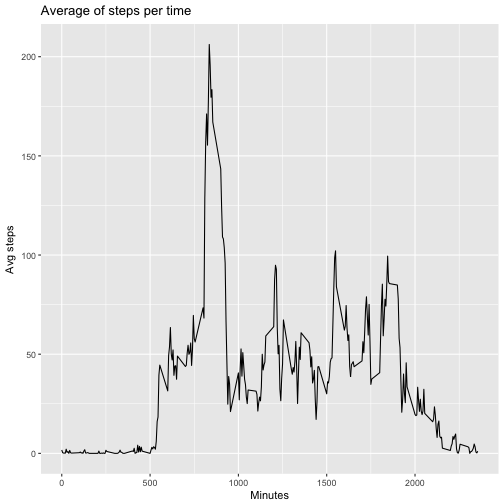
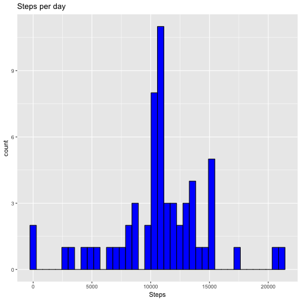
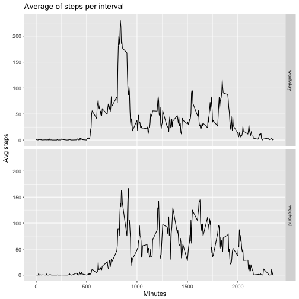

---
title: "Reproducible Research: Peer Assessment 1"
output: 
  html_document:
    keep_md: true
---


## Loading and preprocessing the data

```r
workspace <- "<your_workspace>"
setwd(workspace)
```

```
## Error in setwd(workspace): cannot change working directory
```

```r
activity <- read.csv("activity.csv")
summary(activity)
```

```
##      steps                date          interval     
##  Min.   :  0.00   2012-10-01:  288   Min.   :   0.0  
##  1st Qu.:  0.00   2012-10-02:  288   1st Qu.: 588.8  
##  Median :  0.00   2012-10-03:  288   Median :1177.5  
##  Mean   : 37.38   2012-10-04:  288   Mean   :1177.5  
##  3rd Qu.: 12.00   2012-10-05:  288   3rd Qu.:1766.2  
##  Max.   :806.00   2012-10-06:  288   Max.   :2355.0  
##  NA's   :2304     (Other)   :15840
```


## What is mean total number of steps taken per day?

```r
stepsPerDay <- aggregate(steps ~ date, activity, sum)
library(ggplot2)
qplot(stepsPerDay$steps, geom="histogram", main = "Steps per day", xlab="Steps", colour=I("black"), fill=I("blue"), bins=40)
```



```r
mean(stepsPerDay$steps)
```

```
## [1] 10766.19
```

```r
median(stepsPerDay$steps)
```

```
## [1] 10765
```


## What is the average daily activity pattern?

```r
avgStepsPerInterval <- aggregate(steps ~ interval, activity, mean)
qplot(avgStepsPerInterval$interval, avgStepsPerInterval$steps, geom="line", main="Average of steps per time", ylab="Avg steps", xlab="Minutes")
```



```r
avgStepsPerInterval[which.max(avgStepsPerInterval$steps),]$interval
```

```
## [1] 835
```


## Imputing missing values

```r
sum(is.na(activity))
```

```
## [1] 2304
```

```r
activity2 <- activity
for (i in 1:nrow(activity)) {
  row <- activity[i,]
  if(is.na(row$steps)) {
    interval <- row$interval
    stepsEstimation <- avgStepsPerInterval[avgStepsPerInterval$interval %in% interval,]$steps
    activity2[i,1] <- stepsEstimation
  }
}
head(activity2)
```

```
##       steps       date interval
## 1 1.7169811 2012-10-01        0
## 2 0.3396226 2012-10-01        5
## 3 0.1320755 2012-10-01       10
## 4 0.1509434 2012-10-01       15
## 5 0.0754717 2012-10-01       20
## 6 2.0943396 2012-10-01       25
```

```r
stepsPerDay2 <- aggregate(steps ~ date, activity2, sum)
library(ggplot2)
qplot(stepsPerDay2$steps, geom="histogram", main = "Steps per day", xlab="Steps", colour=I("black"), fill=I("blue"), bins=40)
```



```r
mean(stepsPerDay2$steps)
```

```
## [1] 10766.19
```

```r
median(stepsPerDay2$steps)
```

```
## [1] 10766.19
```


## Are there differences in activity patterns between weekdays and weekends?

```r
dayType <- c()
weekendDays <- c("Saturday", "Sunday")
for (i in 1:nrow(activity2)) {
  weekday <- weekdays(as.Date(activity2[i,2]))
  if (weekday %in% weekendDays) {
    dayType <- append(dayType, "weekend")
  }
  else {
    dayType <- append(dayType, "weekday")
  }
}
activity2$dayType <- dayType
head(activity2)
```

```
##       steps       date interval dayType
## 1 1.7169811 2012-10-01        0 weekday
## 2 0.3396226 2012-10-01        5 weekday
## 3 0.1320755 2012-10-01       10 weekday
## 4 0.1509434 2012-10-01       15 weekday
## 5 0.0754717 2012-10-01       20 weekday
## 6 2.0943396 2012-10-01       25 weekday
```

```r
avgStepsPerInterval2 <- aggregate(steps ~ interval + dayType, activity2, mean)
ggplot(data = avgStepsPerInterval2, mapping = aes(x = interval, y = steps)) + geom_line() + facet_grid(dayType ~ .) + xlab("Minutes") + scale_y_continuous("Avg steps") + ggtitle("Average of steps per interval")
```




